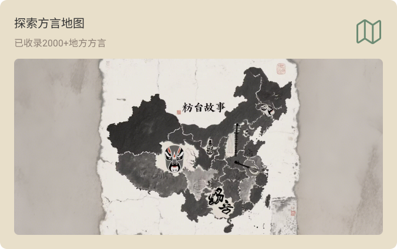
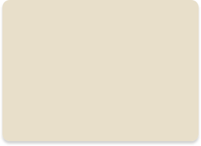
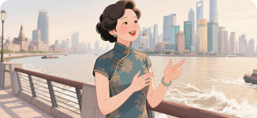
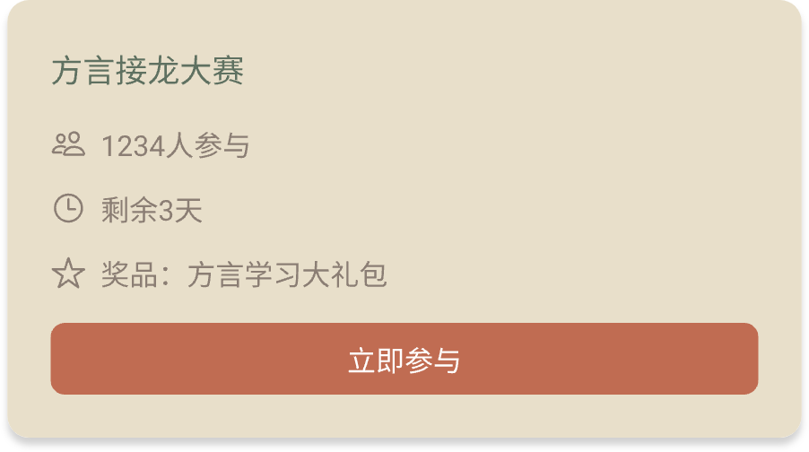
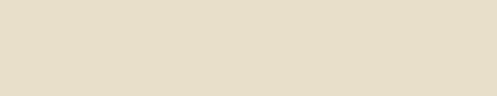
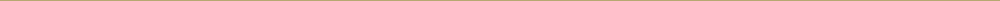
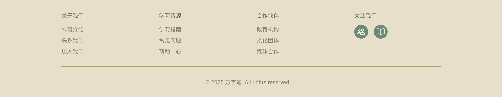

需求

环境：vue3

先帮我生成首页页面，其他页面我叫你生成你再生成，图标我给你的是图片，如果不行我可以给你链接css、svg代码，不行你再跟我说，然后热门学习课程跟正在进行的方言挑战预留一下与后端对接，

这是最终效果图：
.png)

需要的组件如下：

1. 背景图

   .png)

2.  菜单栏：

最左边的logo：

logo旁边的文字：.png)

中间的菜单：首页图标，菜单位于首页的图标：.png)，不在时的图标：，字体颜色跟图标一样，

地图图标：未选择.png)，选中时：.png)

学习图标：未选择：.png)，选中时：

社区图标：未选中：，选中时：

我的图标：未选择.png)，选中时：

搜索框背景：.png)

搜索图标：

3. 左上角：
4. 右上角：.png)，这个图的居中按钮

5. 中间：

6. 热门学习课程

   1. 图一：
      这是背景图，四个图都一样，里面的图片：

      这是最终的效果图：.png)，下面的文字按这个排版

      2. 图二：.png)
         ，文字排版跟内容跟背景如图一
      3. 图三：.png)，文字排版跟内容跟背景如图一
      4. 图四：.png)，文字排版跟内容跟背景如图一

7. 正在进行的方言挑战

   图一：背景图：.png)，按钮：.png)

   

图标：、、

最终效果图：

另外两个直接跟图一一样就行，后面我自己再修改，

最下面页脚背景图：

下面横线：

关于我们下面的两个图标：
、

这是最终效果图：

