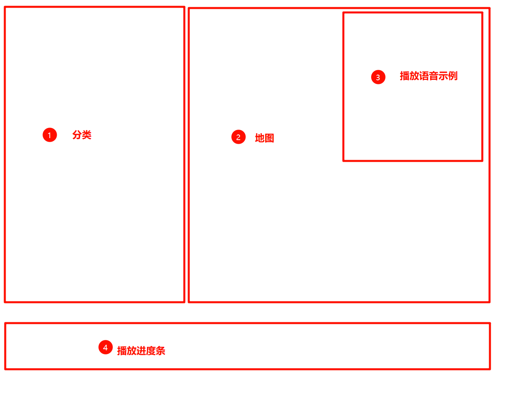
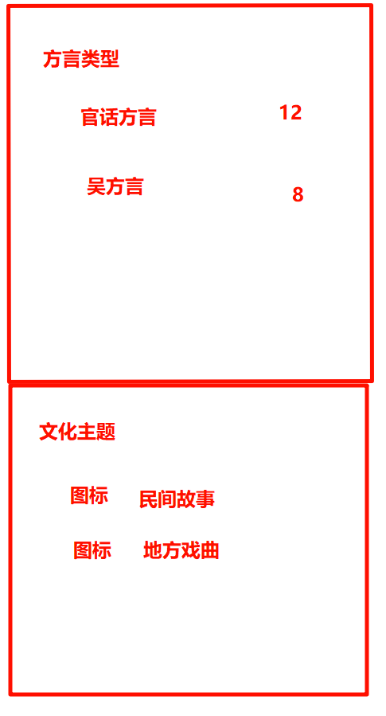
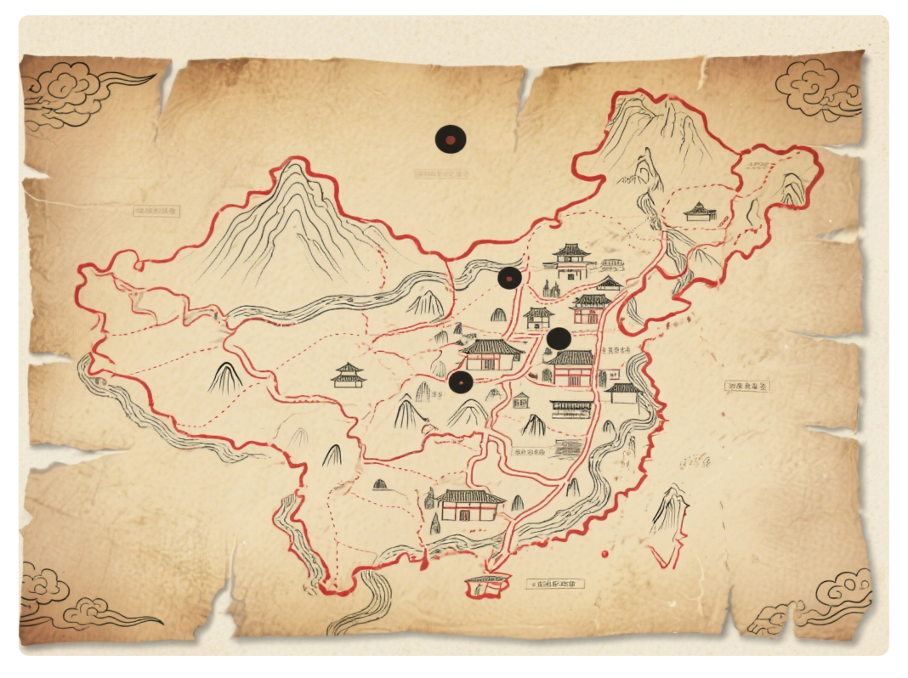
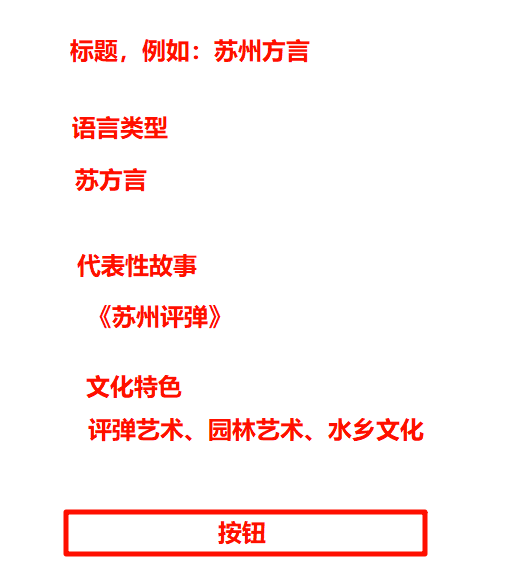
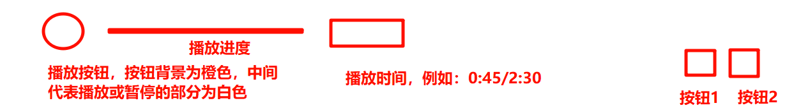

需求：

继续帮我完成地图页面的开发，参照首页，把中间部分重新开发就行：

中间部门是这样一个布局

### 1. 分类：

布局：

1. 分类背景图片：

   .png)

2. 方言类型模拟数据：
   官话方言  12

   吴方言  8

   闽方言  6

   粤方言   7

   客家方言 5
   湘方言  4

   赣方言  5

3. 文化主题

      民间故事

     地方戏曲

     民俗节日

     地方小吃

     传统工艺

### 2. 地图

地图图片：

### 3. 播放语音示例

布局：

按钮：

直接使用这个图片当按钮

### 4. 播放进度条

布局

按钮1图标：

按钮2图标：
